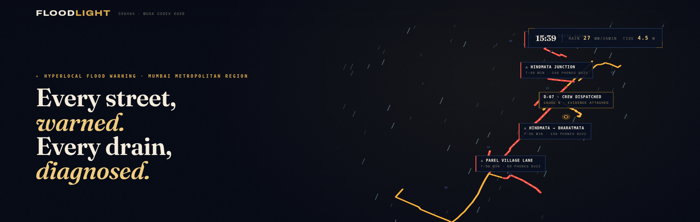
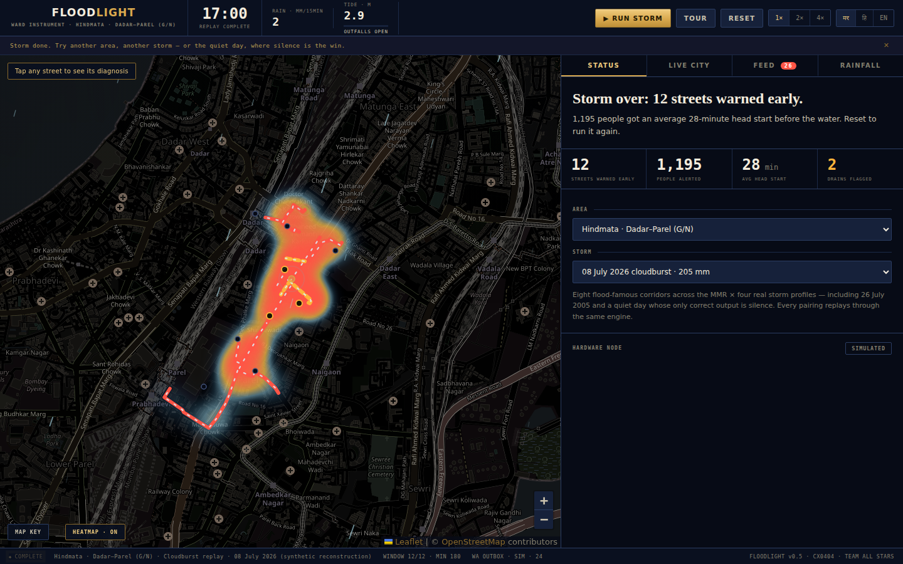
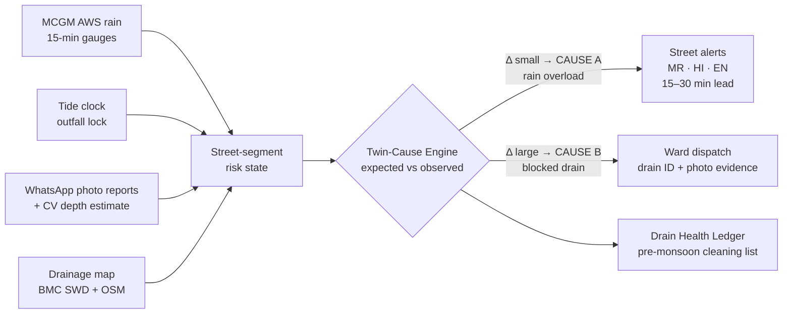
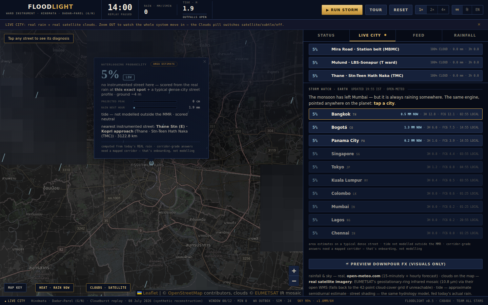
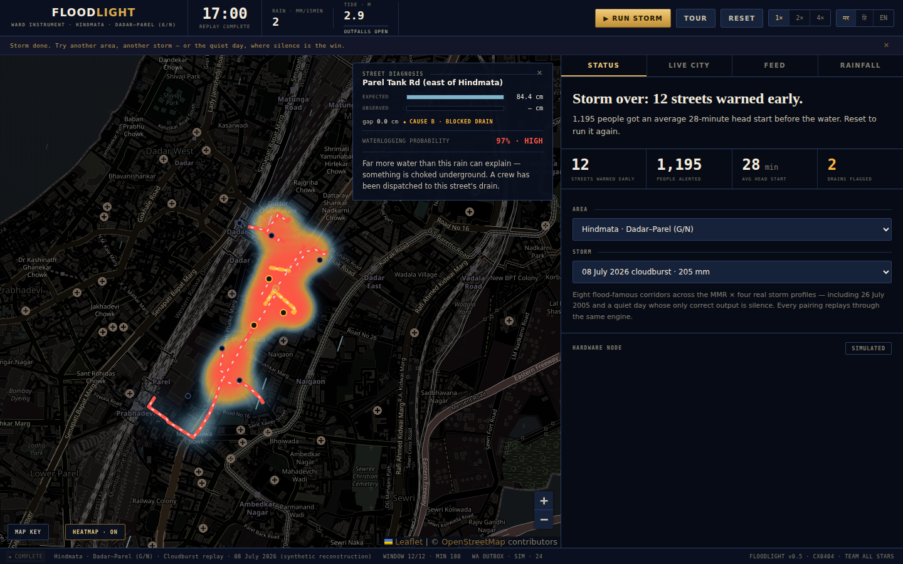
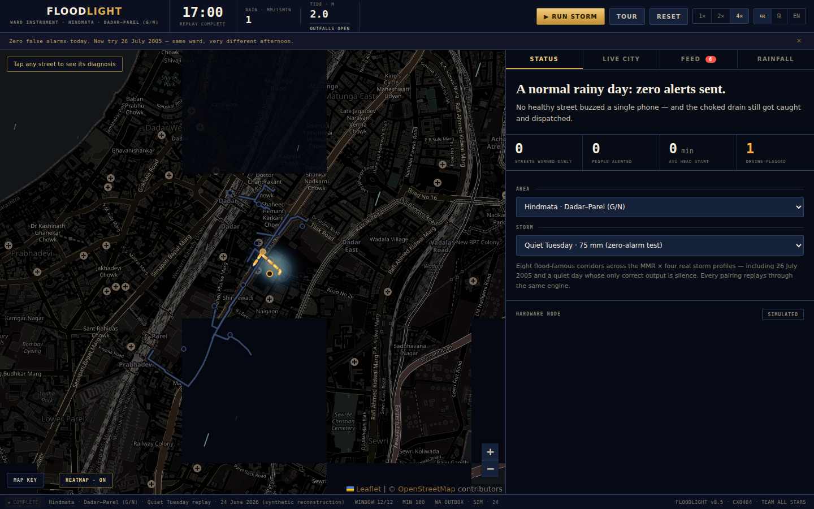
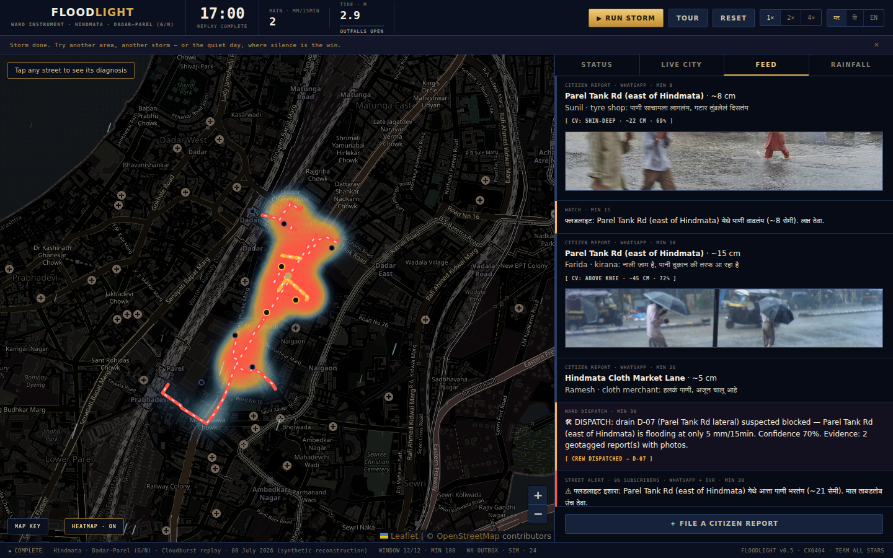
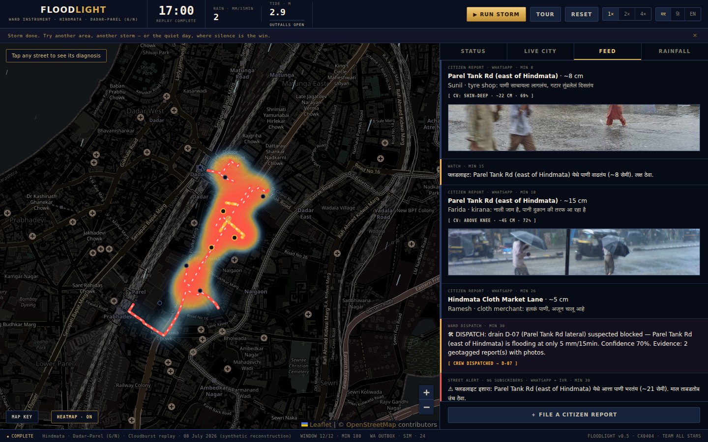
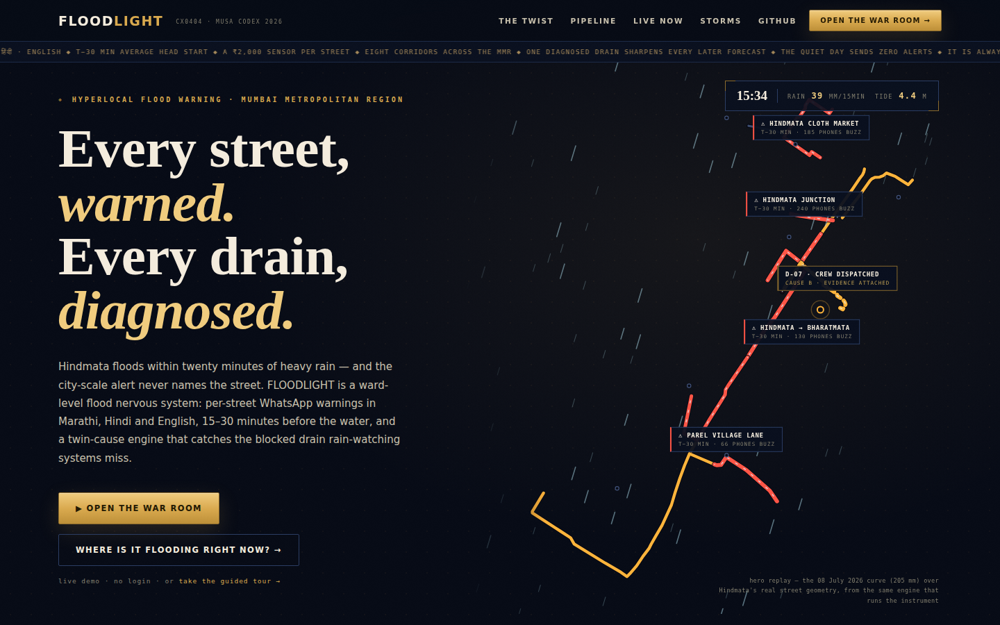

<p align="center">
  
</p>

<h3 align="center">Every street, <em>warned.</em> &nbsp;Every drain, <em>diagnosed.</em></h3>

<p align="center">
  <b>A ward-level flood nervous system for Mumbai — and a scanner that points the same engine
  anywhere on Earth it is raining right now.</b><br/>
  <sub>MUSA CodeX 2026 · Problem <b>CX0404 “Flood Street, No Warning”</b> · Smart Cities &amp; Urban Development · Team <b>ALL STARS</b></sub>
</p>

<p align="center">
  
  
  
  
  
  
</p>

<p align="center">
  <b>▶ Live demo: <a href="https://floodlight.onrender.com">floodlight.onrender.com</a></b>
  <sub>&nbsp;· free tier, a cold start can take a minute</sub>
</p>

<table align="center">
  <tr>
    <td><a href="https://floodlight.onrender.com">/</a></td>
    <td>the pitch page — the hero replays the real 205&nbsp;mm curve over Hindmata's real streets</td>
  </tr>
  <tr>
    <td><a href="https://floodlight.onrender.com/app">/app</a></td>
    <td>the war room — press <b>▶ RUN STORM</b> (space works too)</td>
  </tr>
  <tr>
    <td><a href="https://floodlight.onrender.com/app?tour=1">/app?tour=1</a></td>
    <td>the guided tour — the storm narrates itself in title cards</td>
  </tr>
  <tr>
    <td><a href="https://floodlight.onrender.com/app?watch=1">/app?watch=1</a></td>
    <td><b>STORM WATCH · EARTH</b> — fly to wherever on the planet it is flooding <i>right now</i></td>
  </tr>
  <tr>
    <td><a href="https://floodlight.onrender.com/app?storm=monsoon-2005&autoplay=1">/app?storm=monsoon-2005&autoplay=1</a></td>
    <td>26 July 2005 — the 944&nbsp;mm day, replayed</td>
  </tr>
  <tr>
    <td><a href="https://floodlight.onrender.com/app?storm=quiet&autoplay=1">/app?storm=quiet&autoplay=1</a></td>
    <td>Quiet Tuesday — the day whose only correct output is silence</td>
  </tr>
</table>

---

A specific stretch of road floods every monsoon **within twenty minutes of heavy rain**, and shopkeepers only
realise it once water is already inside their shops. City-scale alerts cannot warn a street. And the same ward
floods for **two entirely different reasons** — genuine rainfall overload, or a **blocked drain even in moderate
rain** — a system that only watches rainfall completely misses the second, more common cause.

FLOODLIGHT answers both halves of that problem:

- **Every street, warned** — street-segment forecasts fire WhatsApp/IVR alerts in **Marathi, Hindi and English**
  15–30 minutes *before* the water arrives, per-street, not per-city.
- **Every drain, diagnosed** — a **Twin-Cause Engine** continuously compares *expected* flooding (rain × drain
  capacity × tide) against *observed* flooding (citizen photo reports + an optional ₹2k level sensor). When the
  water beats the model, the cause is underground: the drain's health score drops and the ward war room gets a
  dispatch card with the evidence attached.

<p align="center"></p>
<p align="center"><sub>Storm over: 12 streets warned early, 1,195 people with a 28-minute head start, both choked
drains caught — the blocked one still marching amber dashes. Calm by default; every detail is one tap away.</sub></p>

## The twist, in one diagram



The blockage belief feeds **back into the forecast**: one diagnosed drain immediately sharpens every later
prediction on its streets. The system learns the ward, storm by storm.

## STORM WATCH · EARTH — it is always raining somewhere

The monsoon retreats from Mumbai in late September. The engine does not care: rainfall physics is not
a Mumbai monopoly. **Storm Watch** sweeps 32 flood-famous cities across every longitude band — Chennai to
Jakarta, Lagos to Bogotá — in one batched [Open-Meteo](https://open-meteo.com) call, and ranks who the
engine would be warning *at this minute*, each with its local clock, sky condition and 6-hour projection.

Tap a city and the map **flies across the planet** — the EUMETSAT infrared mosaic is global, so the journey
rides over the real clouds — and answers at the far end with the same honest tap-anywhere card, computed
from the rain falling at that exact spot on a typical dense street. The popup names its nearest
instrumented corridor (*“Thane Stn (E) · 3,122 km”*) and says the quiet part out loud:
**corridor-grade answers need a mapped corridor — that's onboarding, not modelling.**

<p align="center"></p>
<p align="center"><sub>19:55 IST in the war room, 02:55 in Bangkok — the scanner ranks the planet's wet cities,
the map has flown to the wettest, and the area estimate is computed from the rain actually falling there.
Tide is scored neutral outside the MMR and labelled so.</sub></p>

## Quickstart

```bash
pip install -r requirements.txt
python run.py
# open http://localhost:8737 — the landing page — and step into the war room,
# or go straight to http://localhost:8737/app and press ▶ RUN STORM.
# Pressed for time? /app?tour=1 narrates the storm; /app?watch=1 flies to
# wherever on Earth it is raining right now.
```

**Eight flood-famous corridors across the Mumbai Metropolitan Region × four real storm profiles** — every
pairing replays through the same engine. Island city to the northern suburbs and across the creek:
Hindmata, Milan Subway, King's Circle, **Kurla**, **Mulund**, **Borivali–Dahisar**, **Thane** and
**Mira Road** — all road-snapped from OSM, each with its own drains and its own notorious blockage:

| | Areas (road-snapped OSM corridors) | Storms (15-min AWS cadence) |
|---|---|---|
| MCGM wards | Hindmata · Milan Subway · King's Circle · Kurla · Mulund · Borivali–Dahisar | **08 July 2026 cloudburst · 205 mm** — the flagship run |
| Beyond the city | **Thane (TMC)** · **Mira Road (MBMC)** | **26 July 2005 · the 944 mm day** — Mumbai's benchmark catastrophe |
| Live region strip | every corridor's REAL rain + risk right now, tap to jump | **29 Aug 2017 · ~331 mm** — the day the city re-lived 2005 |
| The whole planet | **Storm Watch** ranks 32 world cities by live rain | **Quiet Tuesday · 75 mm** — the day whose only correct output is **silence** |

Flagship pairings carry hand-authored citizen traffic; every other pairing gets deterministic crowd
scripts derived from the hydrology itself. On the quiet day, **zero healthy streets alert** and the blocked
drain still gets caught — in *all eight corridors* (pinned by tests — the matrix runs 32 replays).

### LIVE CITY — real rainfall, right now

The **Live city** tab leaves the replay entirely: it pulls **real 15-minutely rainfall** for the active
ward from Open-Meteo (keyless, genuinely live), shades the streets with the same hydrology fed today's
actual rain, and draws the weather — rain particles scale with the real rate, flooding streets run
animated flow-lines, and a **rain heatmap** paints precipitation across Greater Mumbai from a 42-point
grid (in replay mode the heat layer shows waterlogging depth instead).

**The sky, before the first drop.** A sky-state strip names the moment in plain words (*OVERCAST · 96%
CLOUD*, *THUNDERSTORM EXPECTED ~16:00 · in ~2 h*); a tappable **12-hour outlook** shows each hour's cloud,
expected rain and probability; the heat pill gains a **NEXT 6 H** forecast mode; and the MMR strip reads
*34% now ▲ 78% within 6 h* when risk is climbing. The clouds on the map are **the real ones** —
EUMETSAT's geostationary-ring infrared mosaic (10.8 µm, open WMS), zoom-aware so the instrument stays
legible over streets and becomes a forecaster's satellite loop when you pull out. Every forecast value is
labelled as a forecast; nothing pretends to be a measurement.

**Tap anywhere on the planet → waterlogging probability.** Click any land point and FLOODLIGHT returns a
calculated probability — a calibrated logistic over projected peak depth, scaled by drain health, tide
lock and proximity on an instrumented corridor; an honestly-graded **AREA ESTIMATE** from the rain at
that exact spot plus terrain elevation anywhere else. Only open water refuses to invent a number.
Outside the MMR the tide is scored neutral and the card says so.

**What to watch during the flagship replay**

| Storm clock | What happens | Why it matters |
|---|---|---|
| 14:30 | Parel Tank Rd reports water at only 9 mm/15min → **CAUSE B**, drain `D-07` flagged, crew dispatched with photo evidence | The rain-only blind spot, caught in 30 minutes |
| 15:00 | Hindmata bowl street alert fires — **T−30 min before water crosses the doorstep** | Lead time, not commentary |
| 15:30 | Tide crosses ~3 m — outfalls seal, the model expects the surge before it happens | Mumbai-specific physics, encoded — drawn on the storm chart |
| 17:00 | 12 street alerts · ~1,200 people warned · avg 28 min lead · drains diagnosed | The KPIs the ward actually cares about |

File your own citizen report from the composer while the storm runs — the engine ingests it on the next
window exactly like the scripted WhatsApp traffic. Presenting? **Space** runs/pauses, **T** starts the
tour, **R** resets.

<table align="center">
  <tr>
    <td align="center"><br/><sub><b>Tap a street →</b> expected vs observed, and the verdict in plain language</sub></td>
    <td align="center"><br/><sub><b>The negative case:</b> a normal rainy day sends zero alerts — drain still caught</sub></td>
  </tr>
  <tr>
    <td align="center"><br/><sub><b>Cause B →</b> crew dispatched with photo evidence, storm-minute 30</sub></td>
    <td align="center"><br/><sub><b>Cause A →</b> trilingual alerts with a real head start</sub></td>
  </tr>
</table>

## How it works

| Stage | Module | The idea |
|---|---|---|
| LISTEN | [`engine/replay.py`](floodlight/engine/replay.py) | 15-min windows of rain + tide + geotagged crowd reports + sensor readings |
| EXPECT | [`engine/hydrology.py`](floodlight/engine/hydrology.py) | Per-segment excess-rain model: drain capacity, bowl factor, **tide-lock multiplier** |
| COMPARE | [`engine/twin_cause.py`](floodlight/engine/twin_cause.py) | Expected vs observed → cause verdict; blockage beliefs update Bayesian-style and feed back into EXPECT |
| WARN | [`engine/alerts.py`](floodlight/engine/alerts.py) | Nowcast projection buys the lead time; alerts render in mr/hi/en; dispatch cards carry drain ID + evidence |
| SCAN | [`engine/livefeed.py`](floodlight/engine/livefeed.py) | LIVE CITY + STORM WATCH: real rain in, same hydrology out, honestly labelled |
| SHOW | [`static/`](floodlight/static/) | Leaflet war room fed by one SSE stream — no framework, no build step |

```bash
python -m pytest tests/ -q          # 35 green
```

The tests pin what the pitch claims: tide lock amplifies flooding · two surprising reports diagnose and
dispatch a blocked drain exactly once · a full replay produces early trilingual alerts with real lead time ·
the quiet-day replay sends **zero** street alerts while still catching D-07 — across all eight corridors ·
WhatsApp payloads parse into reports (depth from "15cm" or "घुटनों तक") · a hardware sensor reading
overrides the script · CV depth estimation discriminates between bands on real photos · the world scanner
stays calm in steady rain and ranks violent rain HIGH with a climbing projection.

## Beyond the replay — already wired

| Capability | Where | Turn it on |
|---|---|---|
| **Live city feed** | [`engine/livefeed.py`](floodlight/engine/livefeed.py) | `FLOODLIGHT_MODE=live MCGM_RAIN_URL=… python run.py` — same interface as the replay file, degrades to zero-rain + a DEGRADED flag if the feed drops |
| **WhatsApp Cloud API** | [`engine/whatsapp.py`](floodlight/engine/whatsapp.py) + `/webhook/whatsapp` | Point Meta's webhook here with `WHATSAPP_VERIFY_TOKEN`; set `WHATSAPP_TOKEN` + `WHATSAPP_PHONE_ID` and outbound alerts go real — without them, the sim outbox logs every byte that would send (`/api/outbox`) |
| **CV depth from photos** | [`engine/cv_depth.py`](floodlight/engine/cv_depth.py) | Always on — every photo report gets a waterline/band estimate with confidence; reporter's own estimate stays the fallback |
| **Hardware level node** | [`hardware/floodlight_node.ino`](hardware/floodlight_node.ino) + `POST /api/sensor` | Flash the ₹2k ESP32 + ultrasonic build, or fake it: `python tools/sensor_sim.py` — the dashboard flips to LIVE HARDWARE on the first reading |

## Deploy (give judges a URL)

Already done: **https://floodlight.onrender.com** (Render free tier — cold starts take up to a minute).
A single uvicorn process, no database. [`render.yaml`](render.yaml) and a `Procfile` are included:
start command `uvicorn floodlight.app:app --host 0.0.0.0 --port $PORT`, health check `/healthz`.

## Design language

**Marine Drive, midnight, monsoon.** The interface is a serious hydrological instrument built from
Mumbai's own materials — the city's Art Deco seafront, at night, in the rain — rather than the default
dark-dashboard look:

- **monsoon-midnight navy** surfaces split by hairline rules; **warm cream** ink, never cold gray
- **brass/gold chrome** on everything interactive — Marine Drive is a UNESCO Art Deco ensemble, so the
  glamour is native, not imported; deco lives in details (diamond bullets, corner brackets, the
  cinema-marquee storm ticker)
- **Fraunces** for the few earned editorial moments (the headline, the summary line, the tour's
  title-card captions); **Archivo** for UI; **Space Mono** strictly for data
- **status colours stay functional and hot** — signal amber (watch · blocked), coral vermillion (alert),
  ice for water in motion — never reused as decoration, and verified colour-blind-separable
- **cased cartographic strokes** on the navy-tinted map — dark casing under a solid colour fill, the way
  professional GIS tools draw roads; the blocked drain marches amber dashes because that *is* signal
- **honest charts** — the storm profile is two stacked lanes on a shared clock (never a dual axis):
  single-hue rain bars with the future outlined, the tide against the drawn ~3 m outfall-seal threshold
- **progressive disclosure** — a plain-language serif status line and four numbers by default; the street
  diagnosis, the raw feed, the storm profile and the report composer all open on demand

<p align="center"></p>
<p align="center"><sub>The landing hero replays the real 08 July 2026 curve over Hindmata's real street
geometry — from the same engine that runs the instrument.</sub></p>

## Honest data notes

- **Replay series are synthetic reconstructions** shaped after real MCGM AWS cloudburst records and spring-tide
  curves — clearly labeled in-app. The live system reads the same shapes from `dm.mcgm.gov.in`.
- **Live rainfall, sky and forecasts are real** — [Open-Meteo](https://open-meteo.com), keyless,
  15-minutely; clouds on the map are EUMETSAT's infrared mosaic. Every forecast is labelled a forecast.
- **Storm Watch is an honest estimate** — a typical dense street (≈18 mm/h effective drainage), crest-tracked
  through a convectively-concentrated forecast, tide neutral outside the MMR and labelled so. It never
  impersonates corridor data: mapped corridors are onboarding, not modelling.
- **Segment geometry is road-snapped to real OSM streets** (Overpass extract + shortest-path along the named
  ways; two small market/approach lanes hand-traced where OSM has no drivable way) — production ingests
  BMC SWD drainage geometry directly.
- Citizen report photos are licensed archive images standing in for WhatsApp attachments:
  “Bombay flooded street” 2005 (Wikimedia Commons, CC BY 2.0), Rakesh Krishna Kumar (CC BY-SA 2.0),
  PlaneMad (CC BY-SA 3.0). Map tiles © OpenStreetMap contributors.

## Grand Finale (27 Sep)

The roadmap landed early. Stage kit, built in: the landing page opens the pitch, **TOUR** narrates the
flagship storm in title cards cut from live engine data, every alert lands as a cinematic lower-third in
the selected language, **STORM WATCH · EARTH** proves the engine on whichever city the planet is soaking
*during the demo*, and the whole instrument works on a phone — the demo URL survives being opened from
the audience. What remains is connection and theatre: venue Wi-Fi, the live sensor bucket-dunk, and
thresholds tuned on a Hindmata field walk.

## Team ALL STARS

**Saud Satopay** · systems, data &amp; integration — **Harsh Mishra** · backend &amp; inference —
**Parva Panchal** · product &amp; field research

*Built for MUSA CodeX 2026 (Maharashtra University Students Association). MIT licensed.*
