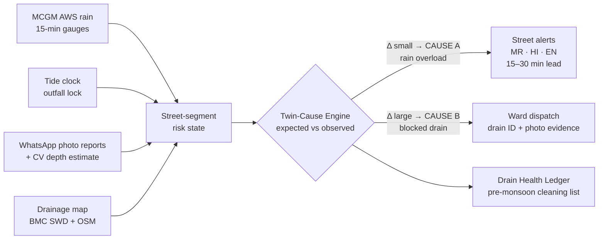

<p align="center">
  
</p>

<p align="center">
  <b>Hyperlocal flood warnings for Mumbai — every street warned, every drain diagnosed.</b><br/>
  <sub>MUSA CodeX 2026 · Problem <b>CX0404 “Flood Street, No Warning”</b> · Smart Cities & Urban Development · Team <b>ALL STARS</b></sub>
</p>

<p align="center">
  
  
  
  
</p>

---

A specific stretch of road floods every monsoon **within twenty minutes of heavy rain**, and shopkeepers only
realise it once water is already inside their shops. City-scale alerts cannot warn a street. And the same ward
floods for **two entirely different reasons** — genuine rainfall overload, or a **blocked drain even in moderate
rain** — a system that only watches rainfall completely misses the second, more common cause.

FLOODLIGHT is a ward-level flood nervous system that answers both halves of that problem:

- **Every street, warned** — street-segment forecasts fire WhatsApp/IVR alerts in **Marathi, Hindi and English**
  15–30 minutes *before* the water arrives, per-street, not per-city.
- **Every drain, diagnosed** — a **Twin-Cause Engine** continuously compares *expected* flooding (rain × drain
  capacity × tide) against *observed* flooding (citizen photo reports + an optional ₹2k level sensor). When the
  water beats the model, the cause is underground: the drain's health score drops and the ward war room gets a
  dispatch card with the evidence attached.

<p align="center"></p>

## The twist, in one diagram



The blockage belief feeds **back into the forecast**: one diagnosed drain immediately sharpens every later
prediction on its streets. The system learns the ward, storm by storm.

## Quickstart

```bash
pip install -r requirements.txt
python run.py
# open http://localhost:8737 and press ▶ Run storm
```

Two scenarios ship in the **Scenario** picker:

- **08 July cloudburst · 205 mm/3 h** — the loud day: early warnings, tide-lock physics, the works.
- **Quiet Tuesday · 75 mm/3 h** — the day that matters just as much: **zero street alerts** are sent
  (no false alarms on an ordinary rainy day), and the blocked drain at Parel Tank Rd *still* gets caught
  and dispatched. The negative case is demonstrated, not claimed.

Both run against the **Hindmata–Parel pilot belt** — 12 road-snapped street segments, 9 drains, scripted
citizen WhatsApp traffic, and a level sensor at Hindmata Junction. Everything downstream of the inputs —
hydrology, classification, alerting, dispatch — is the production code path.

The dashboard is deliberately calm: a plain-language status line, four numbers, and a map. Everything else
is tap-to-reveal — tap a street for its diagnosis card, open the Live feed tab for the raw log (citizen
photos carry their **CV depth-band tags**), Rainfall for the gauge chart, Map key when you need it.

**What to watch for during the replay**

| Storm clock | What happens | Why it matters |
|---|---|---|
| 14:30 | Parel Tank Rd reports water at only 9 mm/15min → **CAUSE B**, drain `D-07` flagged, crew dispatched with photo evidence | The rain-only blind spot, caught in 30 minutes |
| 15:00 | Hindmata bowl street alert fires — **T−30 min before water crosses the doorstep** | Lead time, not commentary |
| 15:30 | Tide peaks at 4.5 m — outfalls seal, the model expects the surge before it happens | Mumbai-specific physics, encoded |
| 17:00 | 12 street alerts · ~1,200 people warned · avg lead ~30 min · 1 drain diagnosed | The KPIs the ward actually cares about |

File your own citizen report from the composer (bottom-right) while the storm runs — the engine ingests it on
the next window exactly like the scripted WhatsApp traffic.

<p align="center">
  
  
</p>

## How it works

| Stage | Module | The idea |
|---|---|---|
| LISTEN | [`engine/replay.py`](floodlight/engine/replay.py) | 15-min windows of rain + tide + geotagged crowd reports + sensor readings |
| EXPECT | [`engine/hydrology.py`](floodlight/engine/hydrology.py) | Per-segment excess-rain model: drain capacity, bowl factor, **tide-lock multiplier** |
| COMPARE | [`engine/twin_cause.py`](floodlight/engine/twin_cause.py) | Expected vs observed → cause verdict; blockage beliefs update Bayesian-style and feed back into EXPECT |
| WARN | [`engine/alerts.py`](floodlight/engine/alerts.py) | Nowcast projection buys the lead time; alerts render in mr/hi/en; dispatch cards carry drain ID + evidence |
| SHOW | [`static/`](floodlight/static/) | Leaflet war-room dashboard fed by one SSE stream — no framework, no build step |

Run the tests:

```bash
python -m pytest tests/ -q
```

Eighteen tests pin what the pitch claims: tide lock amplifies flooding · two surprising reports diagnose and
dispatch a blocked drain exactly once · a full replay produces early trilingual alerts with real lead time ·
the quiet-day replay sends **zero** street alerts while still catching D-07 · WhatsApp payloads parse into
reports (depth from "15cm" or "घुटनों तक") · a hardware sensor reading overrides the script · CV depth
estimation discriminates between bands on real photos.

## Beyond the replay — already wired

| Capability | Where | Turn it on |
|---|---|---|
| **Live city feed** | [`engine/livefeed.py`](floodlight/engine/livefeed.py) | `FLOODLIGHT_MODE=live MCGM_RAIN_URL=… python run.py` — same interface as the replay file, degrades to zero-rain + a DEGRADED flag if the feed drops |
| **WhatsApp Cloud API** | [`engine/whatsapp.py`](floodlight/engine/whatsapp.py) + `/webhook/whatsapp` | Point Meta's webhook here with `WHATSAPP_VERIFY_TOKEN`; set `WHATSAPP_TOKEN` + `WHATSAPP_PHONE_ID` and outbound alerts go real — without them, the sim outbox logs every byte that would send (`/api/outbox`) |
| **CV depth from photos** | [`engine/cv_depth.py`](floodlight/engine/cv_depth.py) | Always on — every photo report gets a waterline/band estimate with confidence; reporter's own estimate stays the fallback |
| **Hardware level node** | [`hardware/floodlight_node.ino`](hardware/floodlight_node.ino) + `POST /api/sensor` | Flash the ₹2k ESP32 + ultrasonic build, or fake it: `python tools/sensor_sim.py` — the dashboard flips to LIVE HARDWARE on the first reading |

## Deploy (give judges a URL)

The app is a single uvicorn process with no database — free tiers eat it happily.
[`render.yaml`](render.yaml) and a `Procfile` are included: connect this repo on
[Render](https://render.com) (or Railway/Fly), and the start command is
`uvicorn floodlight.app:app --host 0.0.0.0 --port $PORT`.

## Honest data notes

- **Replay series are synthetic reconstructions** shaped after real MCGM AWS cloudburst records and spring-tide
  curves — clearly labeled in-app. The live system reads the same shapes from `dm.mcgm.gov.in`.
- **Segment geometry is road-snapped to real OSM streets** (Overpass extract + shortest-path along the named
  ways; two small market/approach lanes hand-traced where OSM has no drivable way) — production ingests
  BMC SWD drainage geometry directly.
- Citizen report photos are licensed archive images standing in for WhatsApp attachments:
  “Bombay flooded street” 2005 (Wikimedia Commons, CC BY 2.0), Rakesh Krishna Kumar (CC BY-SA 2.0),
  PlaneMad (CC BY-SA 3.0). Map tiles © OpenStreetMap contributors.

## Grand Finale (27 Sep)

The roadmap items landed early (table above). What remains for the stage is connection and theatre:
venue Wi-Fi, the live sensor bucket-dunk, and alert thresholds tuned on a Hindmata field walk.

## Team ALL STARS

**Saud Satopay** · systems, data & integration — **Harsh Mishra** · backend & inference —
**Parva Panchal** · product & field research

*Built for MUSA CodeX 2026 (Maharashtra University Students Association). MIT licensed.*
